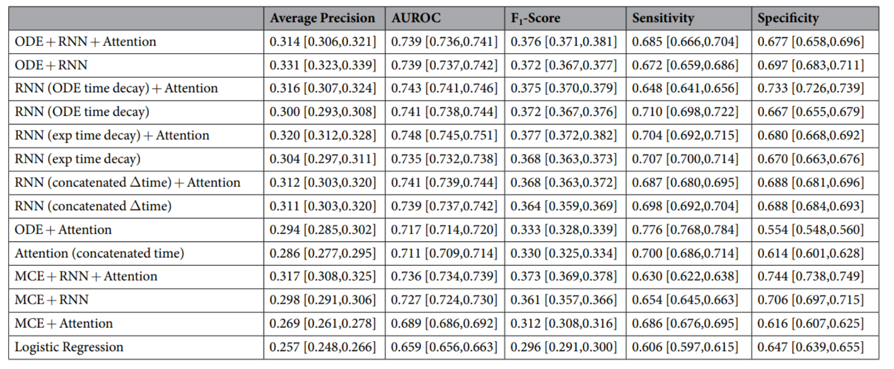
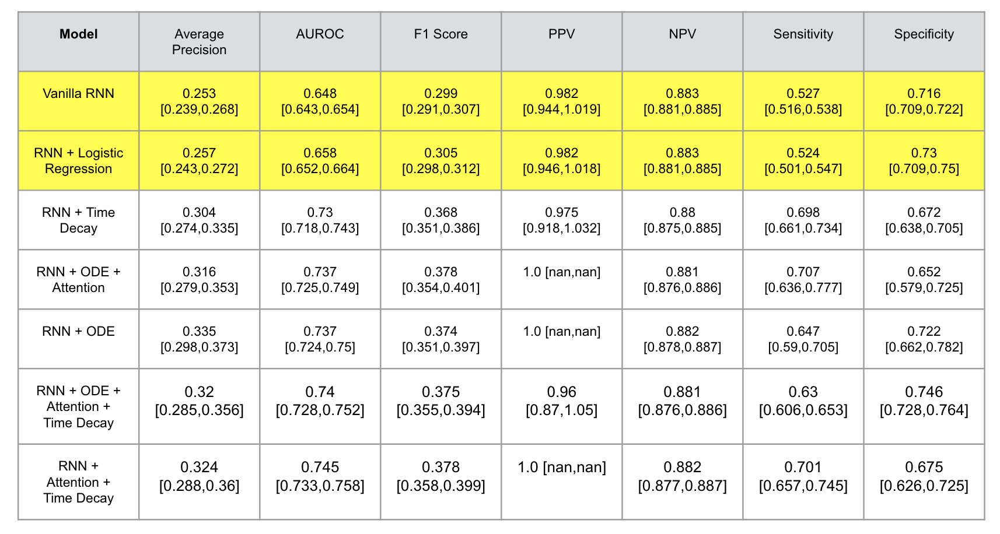

Project Title
Benchmarking deep learning architectures for predicting readmission to the ICU and describing patients-at-risk.

Institution
University of Illinois at Urbana-Champaign, Computer Science Department

Authors
Azaan Barlas
Sukrit Ganesh

Presentation
[Link to CS598 Presentation Video](CS598_Presentation.mp4)

Introduction
The paper we are expanding on (_Benchmarking Deep Learning Architectures for predicting Readmission to the ICU and Describing patients-at-Risk_) utilizes a variety of neural network architectures to predict the probability of patient readmission to an ICU using prior patient medical data. Predicting patient readmission can allow doctors to craft tailored treatment plans for patients and allocate future hospital resources accordingly. Several deep learning architectures that used methods such as attention mechanisms, recurrent layers, neural ordinary differential equations (ODEs), and medical concept embeddings with time-aware attention were used in this paper and trained using the MIMIC-III dataset associated with 45,298 ICU stays for 33,150 patients.

Data Description
The MIMIC-III dataset contains longitudinal electronic medical records for numerous sample patients. Two distinct inputs will be fed into the model: static and timestamped codes. Static data refers to variables describing a specific patient, such as age, sex, insurance type, marital status, etc. Timestamped codes, on the other hand, refer to medical data such as diagnoses, prescriptions, and procedures. These medical entities have unique codes. The timestamped codes provide information about a patient's medical history and will be used to predict readmission risk to the ICU.

The following features are contained within the MIMIC-III dataset:

Clinical Notes
Demographic Information
Admission and discharge information
ICD-9 codes
Lab Results
Medications
Vital Signs
Procedures Performed
Imaging data
The main features that are used in our model after data preprocessing are:

Patient data: demographic data such as age, sex, and other variables.
Readmission rate: dependent variable we are trying to determine.
Diagnosis and procedures: information about the diagnoses and procedures a patient goes through.
Charts and prescriptions: information about prescriptions and charts related to a patient's prescriptions.
Times: times that a patient is diagnosed, prescribed, and when a procedure is performed on the patient.
IDs: IDs for the training, validation, and testing data for each patient's event IDs.
This project will only use ICU admission data from the MIMIC-III dataset; any timestamped codes which take place outside an ICU visit will not be used to compute readmission risk. The dataset maintains patient anonymity and abides by all medical privacy laws.

Results

Original Paper:
https://www.nature.com/articles/s41598-020-58053-z